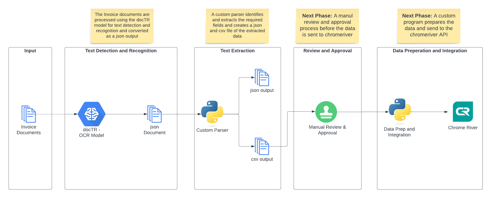

# jams-pub

## Setup

1. Install Ubuntu for wsl
    > wsl --install -d Ubuntu

1. Setup SSH Key
    > chmod 700 ~/.ssh/id_rsa

1. git clone git@github.com:clarkde5/jams-pub.git ~/src/jams-pub

1. git clone git@github.com:clarkde5/jams.git ~/src/jams

1. Install and setup miniconda
    > wget https://repo.anaconda.com/miniconda/Miniconda3-latest-Linux-x86_64.sh && sudo bash Miniconda3-latest-Linux-x86_64.sh -bfp /usr/local
  
    > source activate
  
    > conda init
  
    > conda env create --prefix ~/src/jams-pub/env --file ~/src/jams-pub/conda/environment.yml
  
    > conda activate ~/src/jams-pub/env

1. Install dependencies for docTR
    > sudo apt-get install -y libgl1-mesa-glx libpangocairo-1.0-0

1. Install and setup vscode
    > code ~/src/jams-pub/vscode/jams-pub.code-workspace

    > code --install-extension ms-python.python

## Solution

## Reference

Review [setup-notes](docs/setup-notes.md)

